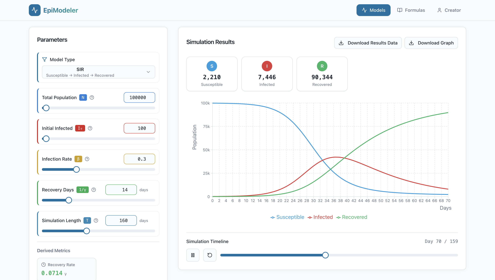

# 🦠 Epimodeler: Multi-Model Epidemic Simulator

  

Inspired by recent reports of the **Nipah Virus** in India and my previous experience using SIR and SIRD models during the **COVID-19** pandemic in 2020, I’ve built **Epimodeler**. 

This project was "vibecoded" using **Google Gemini** and **Lovable** to transform mathematical theory into a functional simulation tool.

## 🧮 Integrated Mathematical Models
Epimodeler includes four core models for analyzing infectious outbreaks:
* **SIR** (Susceptible-Infectious-Recovered)
* **SEIR** (Adds 'Exposed' for incubation periods)
* **SIRD** (Adds 'Deceased' to track mortality)
* **SEIRD** (Comprehensive model including both incubation and mortality)

## 🚀 Key Features
* **Custom Population:** Adjust simulation numbers based on specific regions.
* **Flexible Timeline:** Run simulations for any duration up to **365 days**.
* **Data Visualization:** Real-time computation of outbreak trajectories.

---

### 🔗 Live Project Link
Check out the simulator here: [https://lnkd.in/gucRtQan](https://lnkd.in/gucRtQan)

#EpidemicModel #Mathematics #Computation #PublicHealth #DataScience #Vibecoding
